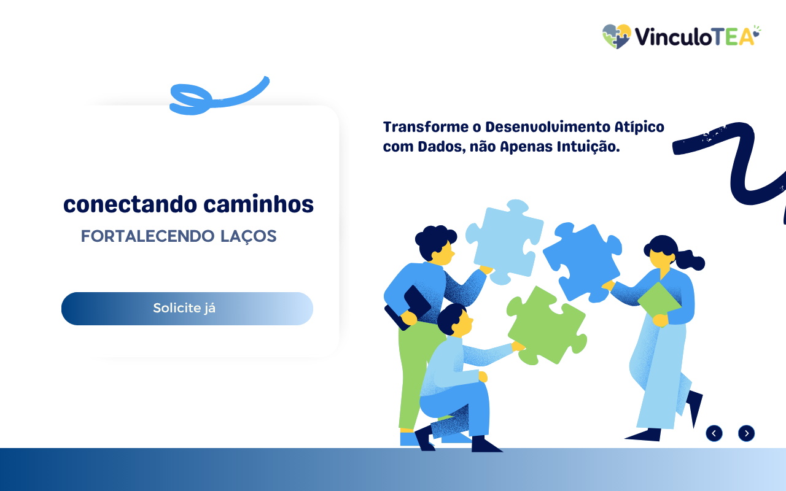

<div align="center">

# VínculoTEA

### Plataforma multidisciplinar para gestão educacional inclusiva e acompanhamento de alunos com TEA

<a href="https://github.com/StellaKarolinaNunes/VinculoTEA">
  
</a>

<br>


<br><br>

<p align="center">
  <a href="https://github.com/StellaKarolinaNunes/VinculoTEA">
    
  </a>
  <a href="./fluxograma/FLUXOGRAMA.md">
    
  </a>
</p>

</div>

---

## Sobre o projeto

O **VínculoTEA** é uma plataforma de gestão multidisciplinar voltada à educação inclusiva e ao acompanhamento de alunos com Transtorno do Espectro Autista.

A aplicação centraliza informações pedagógicas, administrativas e de acompanhamento em um único ambiente, permitindo que escolas, profissionais, famílias e responsáveis tenham acesso organizado aos dados necessários para apoiar a jornada educacional do aluno.

O projeto foi desenvolvido com foco em organização institucional, proteção de dados, acessibilidade, comunicação entre profissionais e acompanhamento individualizado por meio de recursos como prontuário centralizado, Plano Educacional Individualizado, agenda, relatórios e controle de acesso por perfil.

> Este projeto foi desenvolvido para fins educacionais, de pesquisa e portfólio, com foco em educação inclusiva, gestão de dados sensíveis, arquitetura de aplicações web e experiência do usuário.

---

## Objetivo

O VínculoTEA busca reduzir a fragmentação de informações entre escola, família e profissionais que acompanham alunos com TEA.

Em muitos contextos, dados importantes ficam espalhados entre documentos físicos, mensagens, planilhas e relatórios separados. Isso dificulta o acompanhamento contínuo, aumenta o risco de perda de informações e pode atrasar decisões pedagógicas importantes.

A plataforma propõe um ambiente centralizado para registrar informações, acompanhar metas, organizar atendimentos, estruturar PEIs e gerar relatórios de forma mais clara e segura.

---

## Funcionalidades

### Gestão de alunos

* **Cadastro completo:** registro de dados pessoais, informações clínicas, CID, gênero e observações relevantes.
* **Vinculação institucional:** associação entre aluno, família, escola, turma e profissionais responsáveis.
* **Documentação organizada:** upload de foto, documentos e registros relacionados ao acompanhamento.
* **Histórico individual:** visualização de PEIs, anotações, atendimentos e evolução do aluno.

### Plano Educacional Individualizado

* **Wizard de cadastro:** fluxo guiado para criação de novos alunos.
* **Wizard de PEI:** elaboração assistida do Plano Educacional Individualizado.
* **Metas pedagógicas:** definição de objetivos de curto e longo prazo.
* **Indicadores de progresso:** acompanhamento visual da evolução do aluno.
* **Estratégias personalizadas:** registro de pontos fortes, barreiras e orientações de apoio.
* **Exportação em PDF:** geração de documentos com estrutura institucional.

### Central de relatórios

* **Relatório geral:** visão consolidada de alunos, atendimentos e horas registradas.
* **Relatório individual:** acompanhamento de frequência, evolução, atividades e orientações.
* **Estatísticas institucionais:** dados organizados por aluno, profissional, turma e escola.
* **Exportação em PDF:** documentos preparados para impressão e compartilhamento institucional.

### Gestão administrativa

* **Gestão de escolas:** cadastro e organização de instituições da rede.
* **Gestão de turmas:** controle por turno, ano letivo e instituição.
* **Profissionais e professores:** cadastro de membros da equipe multidisciplinar.
* **Disciplinas e especialidades:** gerenciamento de áreas pedagógicas e clínicas.
* **Dashboard administrativo:** indicadores gerais para gestores e responsáveis pela plataforma.

### Agenda de atendimentos

* **Calendário visual:** navegação por mês e visualização de compromissos.
* **Agendamento por aluno:** atendimentos vinculados a aluno e profissional responsável.
* **Tipos de evento:** classificação por atendimento, atividade, evento importante ou agendamento.
* **Acompanhamento de status:** monitoramento dos atendimentos realizados e pendentes.

### Segurança e controle de acesso

* **Autenticação segura:** login com Supabase Auth e JWT.
* **Permissões por perfil:** controle de acesso baseado em funções.
* **Multi-tenancy:** separação de dados entre instituições por `Plataforma_ID`.
* **Row Level Security:** políticas de banco de dados para impedir acessos indevidos.
* **Proteção de dados sensíveis:** estrutura orientada à privacidade e ao controle institucional.

---

## Níveis de acesso

| Permissão             | Administrador | Profissional | Tutor | Família |
| --------------------- | :-----------: | :----------: | :---: | :-----: |
| Visualizar alunos     |       ✅       |       ✅      |   ✅   |    ✅*   |
| Editar alunos         |       ✅       |       ✅      |   ❌   |    ❌    |
| Gerenciar escolas     |       ✅       |       ❌      |   ❌   |    ❌    |
| Gestão administrativa |       ✅       |      ✅**     |   ❌   |    ❌    |
| Acessar relatórios    |       ✅       |       ✅      |   ✅   |    ✅*   |
| Gerenciar usuários    |       ✅       |       ❌      |   ❌   |    ❌    |
| Criar e editar PEI    |       ✅       |       ✅      |  ✅**  |    ❌    |
| Visualizar agenda     |       ✅       |       ✅      |   ✅   |    ✅*   |

> `*` A família acessa somente os dados relacionados aos próprios filhos.
> `**` Acesso parcial conforme permissões definidas pela instituição.

---

## Tecnologias utilizadas

| Tecnologia         | Aplicação no projeto                            |
| ------------------ | ----------------------------------------------- |
| React              | Construção da interface web                     |
| TypeScript         | Tipagem estática e organização do código        |
| Vite               | Ambiente de desenvolvimento e build             |
| Supabase           | Autenticação, banco de dados e serviços backend |
| PostgreSQL         | Persistência dos dados                          |
| Row Level Security | Proteção e isolamento de dados no banco         |
| Framer Motion      | Animações e transições                          |
| Lucide React       | Biblioteca de ícones                            |
| jsPDF              | Geração de documentos PDF                       |
| jsPDF AutoTable    | Construção de tabelas nos relatórios            |
| Vitest             | Testes unitários                                |
| Testing Library    | Testes de componentes                           |
| Playwright         | Testes de ponta a ponta                         |
| Git                | Controle de versão                              |

---

## Destaques técnicos

* Arquitetura organizada por módulos, componentes e serviços;
* Separação entre interface, regras de negócio e integração com banco de dados;
* Controle de acesso baseado em papéis;
* Estrutura multi-institucional com isolamento de dados;
* Uso de Row Level Security no PostgreSQL;
* Serviços específicos para alunos, escolas, turmas, usuários e PEIs;
* Componentes reutilizáveis para dashboards, formulários e fluxos de cadastro;
* Geração de relatórios institucionais em PDF;
* Estrutura preparada para testes unitários e testes E2E;
* Organização preparada para expansão futura com aplicativo mobile e integrações externas.

---

## Estrutura do projeto

```bash
VinculoTEA/
├── src/
│   ├── assets/
│   │   └── images/
│   │       └── Banner.png
│   │
│   ├── components/
│   │   ├── Auth/
│   │   ├── Dashboard/
│   │   │   ├── Students/
│   │   │   │   ├── components/
│   │   │   │   ├── tabs/
│   │   │   │   └── wizards/
│   │   │   │
│   │   │   ├── Gerenciamento/
│   │   │   │   └── tabs/
│   │   │   │
│   │   │   ├── Reports/
│   │   │   ├── Discipline/
│   │   │   ├── Settings/
│   │   │   └── Dashboard.tsx
│   │   │
│   │   └── Error/
│   │       └── ErrorBoundary.tsx
│   │
│   ├── lib/
│   │   ├── supabase.ts
│   │   ├── useAuth.ts
│   │   ├── studentService.ts
│   │   ├── schoolsService.ts
│   │   ├── classesService.ts
│   │   ├── disciplinesService.ts
│   │   ├── userService.ts
│   │   └── peisService.ts
│   │
│   ├── styles/
│   ├── App.tsx
│   └── main.tsx
│
├── supabase/
│   ├── migrations/
│   └── functions/
│
├── public/
├── tests/
├── fluxograma/
│   └── FLUXOGRAMA.md
│
├── .env.example
├── package.json
├── vite.config.ts
├── tsconfig.json
├── README.md
└── LICENSE
```

> Arquivos gerados durante o build, como `node_modules/`, `dist/` e arquivos locais `.env`, não devem ser versionados no Git.

---

## Modelo de dados

```text
Plataformas
│
├── Escolas
│   ├── Turmas
│   ├── Professores
│   └── Alunos
│       ├── PEIs
│       ├── Acompanhamentos
│       ├── Agenda
│       └── Anotações
│
├── Famílias
├── Disciplinas
├── Profissionais
└── Usuários
```

---

## Como executar o projeto

### Pré-requisitos

Antes de iniciar, é necessário ter instalado:

* Node.js `18.x` ou superior;
* npm, yarn ou pnpm;
* Git;
* Conta ativa no Supabase;
* VS Code ou outro editor compatível com React e TypeScript.

### 1. Clone o repositório

```bash
git clone https://github.com/StellaKarolinaNunes/VinculoTEA.git
```

### 2. Acesse a pasta do projeto

```bash
cd VinculoTEA
```

### 3. Instale as dependências

```bash
npm install
```

### 4. Configure as variáveis de ambiente

Crie um arquivo `.env` baseado no arquivo `.env.example`.

```bash
cp .env.example .env
```

No Windows, você pode copiar manualmente o arquivo `.env.example` e renomeá-lo para `.env`.

Adicione as credenciais do seu projeto Supabase:

```ini
VITE_SUPABASE_URL=https://seu-projeto.supabase.co
VITE_SUPABASE_ANON_KEY=sua-chave-anonima
```

> Nunca envie o arquivo `.env` para o GitHub. Ele pode conter informações sensíveis do ambiente.

### 5. Execute a aplicação

```bash
npm run dev
```

Depois, acesse o endereço exibido no terminal, normalmente:

```text
http://localhost:5173
```

---

## Scripts disponíveis

```bash
npm run dev
```

Inicia o projeto em ambiente de desenvolvimento.

```bash
npm run build
```

Gera a versão de produção da aplicação.

```bash
npm run preview
```

Executa localmente a versão compilada para produção.

```bash
npm run test
```

Executa os testes unitários.

```bash
npm run lint
```

Verifica problemas de padrão e qualidade de código.

---

## Roadmap

### Em desenvolvimento

* [ ] Central de relatórios com geração avançada de PDF;
* [ ] Dashboard analítico para gestores;
* [ ] Agenda digital completa com filtros e notificações;
* [ ] Melhorias no fluxo de criação de PEIs;
* [ ] Sistema de notificações para prazos e revisões;
* [ ] Otimização de performance em telas com grande volume de dados;
* [ ] Melhorias de acessibilidade e navegação por teclado.

### Próximos passos

* [ ] Portal da família para acompanhamento dos alunos;
* [ ] Aplicativo mobile com suporte offline;
* [ ] Integração com WhatsApp para notificações;
* [ ] Assistente de IA para apoio pedagógico;
* [ ] Exportação avançada de relatórios;
* [ ] Histórico detalhado de atividades por aluno;
* [ ] Dashboard específico para profissionais;
* [ ] Integração com calendários externos.

---

## Contribuição

Contribuições são bem-vindas.

```bash
# Faça um fork do projeto

# Crie uma branch para sua funcionalidade
git checkout -b feature/nova-funcionalidade

# Faça suas alterações
git add .

# Crie um commit descritivo
git commit -m "feat: adiciona nova funcionalidade"

# Envie sua branch
git push origin feature/nova-funcionalidade
```

Depois, abra um Pull Request explicando as alterações realizadas.

### Diretrizes

* Mantenha o código organizado e legível;
* Utilize TypeScript sempre que possível;
* Preserve a separação entre componentes, serviços e estilos;
* Evite lógica complexa diretamente nos componentes visuais;
* Teste novas funcionalidades antes de abrir um Pull Request;
* Não envie chaves de API, arquivos `.env` ou credenciais para o repositório;
* Atualize a documentação quando uma funcionalidade importante for adicionada.

---

## Licença

Este projeto possui licença proprietária.

```text
Todos os direitos reservados.

O código-fonte, identidade visual, estrutura de dados e documentação
não podem ser utilizados, distribuídos ou modificados sem autorização
prévia dos responsáveis pelo projeto.
```

---

## Créditos

* **Desenvolvimento principal:** [Stella Karolina Nunes](https://github.com/StellaKarolinaNunes)
* **Equipe:** [Aline Cely](https://github.com/AlineCely)
* **Framework:** [React](https://react.dev/)
* **Linguagem:** [TypeScript](https://www.typescriptlang.org/)
* **Build Tool:** [Vite](https://vite.dev/)
* **Backend e autenticação:** [Supabase](https://supabase.com/)
* **Banco de dados:** [PostgreSQL](https://www.postgresql.org/)
* **Animações:** [Framer Motion](https://www.framer.com/motion/)
* **Ícones:** [Lucide React](https://lucide.dev/)
* **Relatórios em PDF:** [jsPDF](https://github.com/parallax/jsPDF) e [jsPDF AutoTable](https://github.com/simonbengtsson/jsPDF-AutoTable)
* **Testes:** [Vitest](https://vitest.dev/), Testing Library e [Playwright](https://playwright.dev/)
* **Tipografia:** [Inter](https://fonts.google.com/specimen/Inter)
